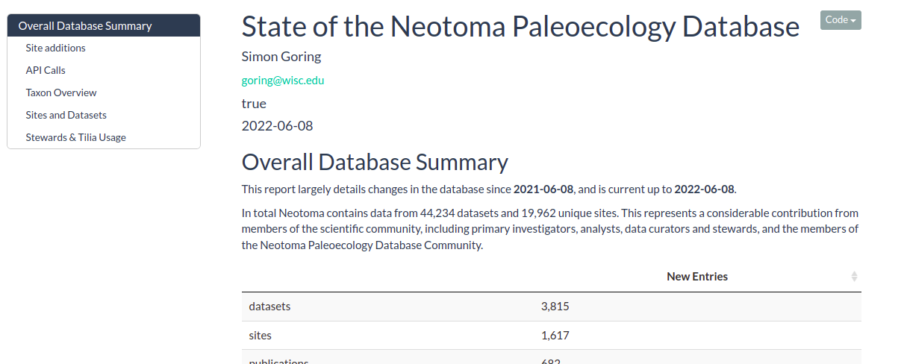

[](https://nsf.gov/awardsearch/showAward?AWD_ID=1550707) [](https://nsf.gov/awardsearch/showAward?AWD_ID=1541002)

# State of the Database 

An RMarkdown document used to derive intermediary statistics for the Neotoma database on a periodic basis. The goal is to containerize the repository so it can be deployed as a scheduled process that would both serve the rendered HTML document, and also provide an artifact of the run/build process that can be used for figures in reports and presentations.

## Contributors

This project is an open project, and contributions are welcome from any individual.  All contributors to this project are bound by a [code of conduct](CODE_OF_CONDUCT.md).  Please review and follow this code of conduct as part of your contribution.

* [](https://orcid.org/0000-0002-2700-4605) [Simon Goring](http://goring.org)

### Tips for Contributing

Issues and bug reports are always welcome.  Code clean-up, and feature additions can be done either through pull requests to [project forks](https://github.com/NeotomaDB/neotoma2/network/members) or [project branches](https://github.com/NeotomaDB/neotoma2/branches).

All products of the Neotoma Paleoecology Database are licensed under an [MIT License](LICENSE) unless otherwise noted.

## How to Run

The following bash script can be used to restore the latest Neotoma snapshot to a local installation.

We can obtain and load the Neotoma database from the [Neotoma Paleoecology Database](https://neotomadb.org) website using the following command-line script. This assumes you have Postgres and PostGIS installed. Here we use the default user `postgres`, and assume that there is an environment variable `PGPASSWORD` set to the `postgres` user's password.  That setup would allow the following script to run without interruption (for example, in a `bash` script).

```bash
mkdir dbout
wget https://www.neotomadb.org/uploads/snapshots/neotoma_ndb_only_latest.tar --no-check-certificate
tar -xf neotoma_ndb_only_latest.tar -C ./dbout
dropdb -h localhost -U postgres neotoma
createdb  -h localhost -U postgres neotoma
psql -h localhost -U postgres -d neotoma -c "CREATE EXTENSION postgis; CREATE EXTENSION pg_trgm;"
psql  -h localhost -U postgres -d neotoma -f ./dbout/neotoma_ndb_only_latest.sql
rm -r ./dbout
```

The above script creates a duplicate of the database locally and then cleans up the `sql` file extracted from the downloaded `tar` archive.

The document expects environment variables (we use defaults here, assuming the Neotoma database has been restored locally):

* DBNAME=neotoma
* HOST=localhost
* PORT=5432
* USER=postgres
* PASSWORD=postgres

These variables are currently set by hand in the `buildStats.sh` bash script.

To execute and build the RMarkdown file, simply run `bash buildStats.sh` and a valid HTML document will be generated and output into the `outputs` folder.


