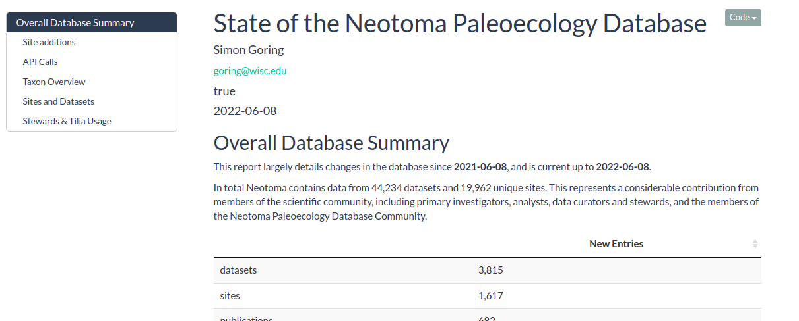

<!-- badges: start -->

[](https://www.tidyverse.org/lifecycle/#stable) [](https://nsf.gov/awardsearch/showAward?AWD_ID=1550707) [](https://nsf.gov/awardsearch/showAward?AWD_ID=1541002)

<!-- badges: end -->

# State of the Database 

An RMarkdown document used to derive intermediary statistics for the Neotoma database on a periodic basis. The goal is to containerize the repository so it can be deployed as a scheduled process that would both serve the rendered HTML document, and also provide an artifact of the run/build process that can be used for figures in reports and presentations.

## Contributors

This project is an open project, and contributions are welcome from any individual.  All contributors to this project are bound by a [code of conduct](CODE_OF_CONDUCT.md).  Please review and follow this code of conduct as part of your contribution.

* [](https://orcid.org/0000-0002-2700-4605) [Simon Goring](http://goring.org)
* [](https://orcid.org/0000-0002-7926-4935) [Socorro Dominguez](https://ht-data.com/about)

### Tips for Contributing

Issues and bug reports are always welcome.  Code clean-up, and feature additions can be done either through pull requests to [project forks](https://github.com/NeotomaDB/neotoma2/network/members) or [project branches](https://github.com/NeotomaDB/neotoma2/branches).

All products of the Neotoma Paleoecology Database are licensed under an [MIT License](LICENSE) unless otherwise noted.

## How to Run

The following bash script can be used to restore the latest Neotoma snapshot to a local installation.

We can obtain and load the Neotoma database from the [Neotoma Paleoecology Database](https://neotomadb.org) website using the following command-line script. This assumes you have Postgres and PostGIS installed. Here we use the default user `postgres`, and assume that there is an environment variable `PGPASSWORD` set to the `postgres` user's password.  That setup would allow the following script to run without interruption (for example, in a `bash` script).

```bash
mkdir dbout
wget https://www.neotomadb.org/uploads/snapshots/neotoma_ndb_only_latest.tar --no-check-certificate
tar -xf neotoma_ndb_only_latest.tar -C ./dbout
dropdb -h localhost -U postgres neotoma
createdb  -h localhost -U postgres neotoma
psql -h localhost -U postgres -d neotoma -c "CREATE EXTENSION postgis; CREATE EXTENSION pg_trgm;"
psql  -h localhost -U postgres -d neotoma -f ./dbout/neotoma_ndb_only_latest.sql
rm -r ./dbout
```

The above script creates a duplicate of the database locally and then cleans up the `sql` file extracted from the downloaded `tar` archive.

### Configuration

The database connection variables are read from a `.env` file in the project root. Copy the provided template and fill in your values:

```bash
cp .env-template .env
```

The `.env` file defines the connection used by the build (defaults shown assume a locally restored Neotoma database):

* DBNAME=neotoma
* HOST=localhost
* PORT=5432
* USER=postgres
* PASSWORD=postgres

### Scripts

* **`run_cloudwatchquery.sh`** — pulls API and Tilia usage statistics from AWS CloudWatch Logs (the Neotoma/Tilia Elastic Beanstalk nginx access logs) and writes them to the `log_run*.json` files that the report reads for its usage charts. It runs several CloudWatch Logs Insights queries, each of which sleeps ~5 minutes while the query completes, so a full pull takes several minutes and requires working `aws` CLI credentials. It is invoked automatically by `buildStats.sh`.
* **`buildStats.sh`** — the main build script. It first runs `run_cloudwatchquery.sh` to refresh the usage logs, then loads the database connection variables from `.env` and renders `StateoftheDB.Rmd` into HTML. It no longer hardcodes credentials; both the local and remote modes use whatever is in `.env`.

### Running the build

To execute and build the RMarkdown file, run:

```bash
bash buildStats.sh local
```

The `local` argument just renders the report; a valid HTML document is generated and output into the `outputs` folder.

Running it with no argument renders the report **and then commits and pushes the rebuilt artifacts** (`git add --all && git commit && git push`), which is how the periodic builds are published:

```bash
bash buildStats.sh
```


